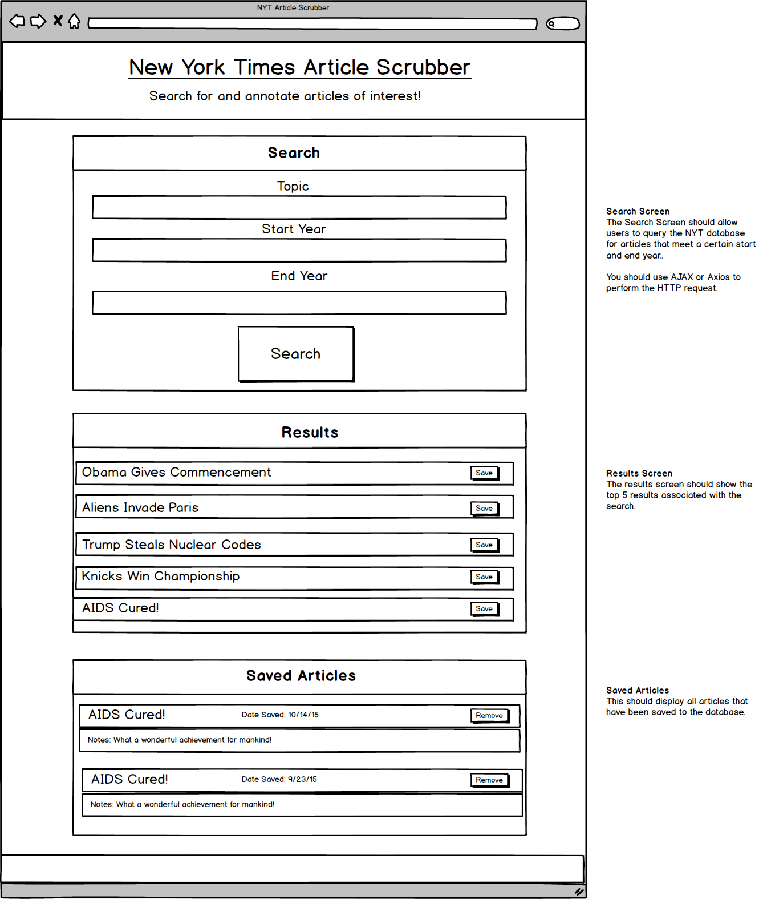

# nytreact
React Search



## Live Link
 - https://wardcj1.github.io/nytreact

## Overview

This homework activity creates a new React-based rendition of a previous New York Times Article Search application. This assignment requires React components, work with helper functions, and utilizes the React mounting lifecycle to query and display articles based on user searches. 

## Technologies Used

* Node
* Express
* MongoDB 

Users can save articles to read later. 

#### Routes
```javascript
 * `/api/saved` (get) - components will use this to query MongoDB for all saved articles

 * `/api/saved` (post) - components will use this to save an article to the database

 * `/api/saved` (delete) - components will use this to delete a saved article in the database

 * `*` (get) - will load single HTML page (with ReactJS) in public/index.html
```